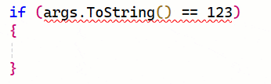
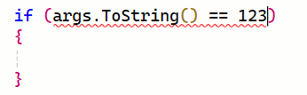

[marketplace]: https://marketplace.visualstudio.com/items?itemName=MadsKristensen.QuoteCompletionFix
[vsixgallery]: http://vsixgallery.com/extension/QuoteCompletionFix.7f3cb70e-73d1-4f29-84dd-5c436e3ccffb/
[repo]:https://github.com/madskristensen/QuoteCompletionFix

# Qupte Completion Fix for C# in Visual Studio

Download this extension from the [Visual Studio Marketplace][marketplace]
or get the [CI build][vsixgallery].

----------------------------------------

> Inspired by [a popular Visual Studio feature request](https://github.com/dotnet/roslyn/issues/71898) on GitHub.

When you type a quotetion mark ("), Visual Studio will automatically insert a closing quotion mark for you following certain rules. It helps with typing speed and accuracy and developers enjoy it. We do, however, hear about times when the feature is a little too eager to auto-insert the closing quotation mark, and that can lead to frustration and the feeling that the IDE is getting in the way.

This is a potential fix.

## Features

* Makes quote completion less intrusive
* Adds quote completion after $ and @ characters

### Less intrusive
In some scenarios, the auto-completion triggers when there is no need for a closing quote. Consider the case when the caret is next to an alphanumeric character when you type a quote   .

 
I can't think of a time I’ve ever wanted the closing quote inserted for me in this situation. The result is that I must now manually delete the auto-completed closing quote. This feels like the IDE is getting in the way instead of helping. 

We should be able to solve this by modifying the rules just a bit. When the caret is located immediately before or after any alphanumeric character, then don’t auto-insert the closing quote. It would make the above scenario behave like this:

 

### Quote completion after $ and @ characters
We’ve heard from some developers that there are times when they expect quote completion, but Visual Studio isn’t providing it. It’s primarily for string interpolation scenarios where you insert quotes immediately after a $ or @ character.

 
As you can see below, Visual Studio doesn’t auto-insert the closing quote, which is what you would expect in this case.
 
But with a simple tweak to the quote completion rules, we can make that happen  .

   

## How can I help?
If you enjoy using the extension, please give it a ★★★★★ rating on the [Visual Studio Marketplace][marketplace].

Should you encounter bugs or if you have feature requests, head on over to the [GitHub repo][repo] to open an issue if one doesn't already exist.

Pull requests are also very welcome, since I can't always get around to fixing all bugs myself. This is a personal passion project, so my time is limited.

Another way to help out is to [sponsor me on GitHub](https://github.com/sponsors/madskristensen).